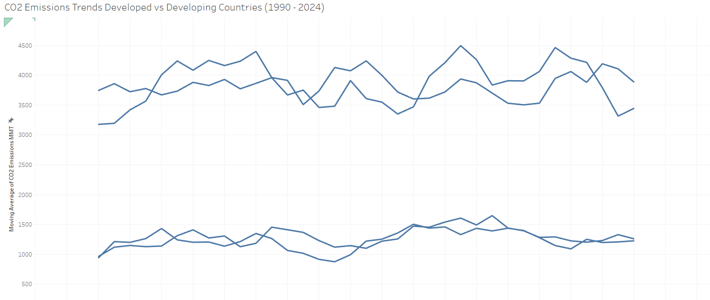
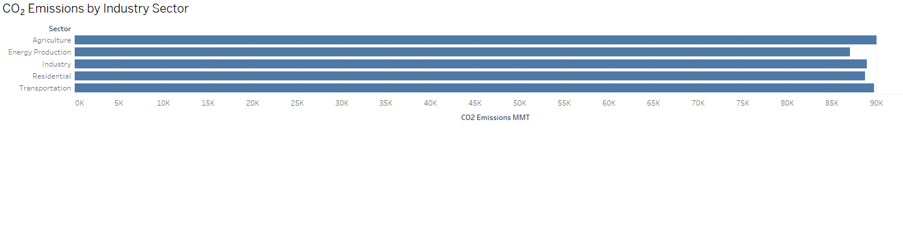
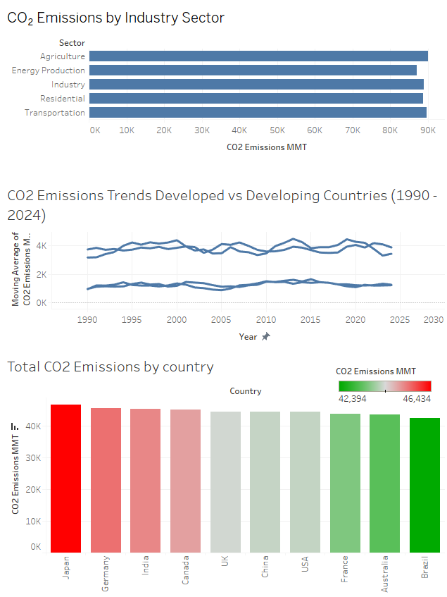
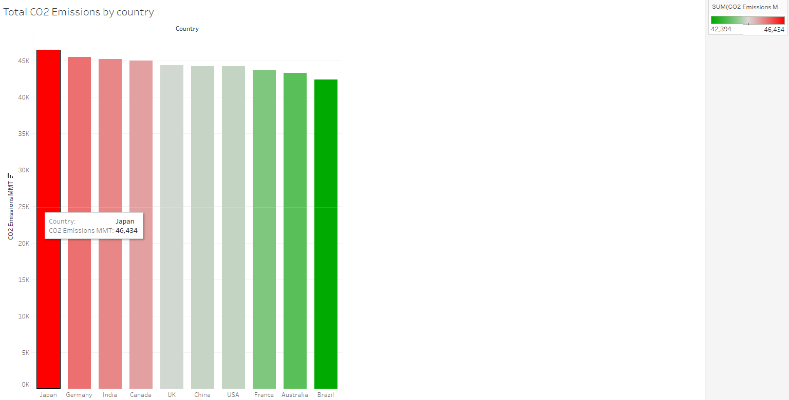

📊 CO₂ Emissions Analysis (SQL + Tableau)

This project investigates global CO₂ emissions patterns, comparing trends between developed and developing countries, analyzing emissions by industry sector, and identifying top-emitting nations. It was completed as part of a portfolio project to demonstrate proficiency in SQL and Tableau for environmental data analysis.

---

🚀 Project Goal

Understand long-term CO₂ emission trends globally and highlight which countries and industries contribute most to rising emissions. Support data-driven decision-making for climate action policies.

---

🔍 Key Questions Answered

- How have emissions changed between developed and developing nations over time?
- Which industry sectors are responsible for the largest share of emissions?
- What are the top countries contributing to global CO₂ output?

---

🛠 Tools & Skills Used

| Tool   | Purpose                          |
|--------|----------------------------------|
| SQL    | Data cleaning and analysis       |
| Tableau| Visualizations and dashboards    |
| CSV    | Raw emission datasets            |

---

📂 Dataset Summary

- File: `CO2_Emissions_Analysis_Dataset.csv`
- Rows: 1,000+ records across 30 years
- Columns:
  - `country`, `year`
  - `industry_sector`, `emissions_mmt`
  - `region_type` (developed or developing)

---

🔎 SQL Scripts Included

- `data_cleaning.sql`: Handles missing values and prepares structured tables
- `emissions_trends.sql`: Analyzes emissions by year, country group
- `country_comparison.sql`: Ranks countries by total emissions

---

📊 Tableau Visualizations

### 📈 CO₂ Emissions Trends (Developed vs Developing, 1990–2024)

### 🏭 Emissions by Industry Sector

### 🌐 Final Dashboard Overview

### 🌎 Total Emissions by Country

_(Dashboard created in Tableau, file: CO2_Emissions_Analysis.twbx)_

---

📌 Key Insights

- Developed nations show fluctuating but declining emissions, while developing nations trend upward
- Energy production and transportation are leading sectors in global CO₂ output
- Japan, Germany, and India are among the top contributors in the dataset analyzed

---

🧪 How to Recreate This Project

1. Clone this repo and download all files
2. Run `.sql` scripts in BigQuery or your preferred SQL engine
3. Load the CSV in Tableau
4. Open `.twbx`
