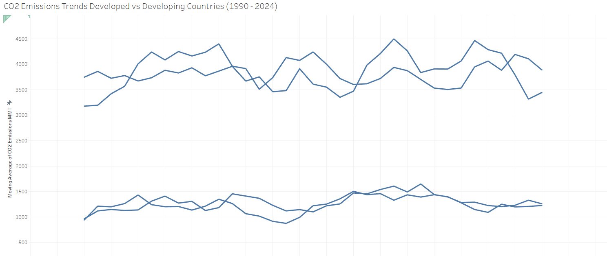

CO₂ Emissions Analysis (SQL + Tableau)

## Project Overview

This project analyzes global CO₂ emissions data to identify long-term trends, compare developed and developing countries, examine emissions by industry sector, and highlight the countries contributing the most emissions within the dataset
The project was built using SQL for data cleaning and analysis, and Tableau for dashboard development and visualization.

---

## Tools Used

- SQL — data cleaning, joins, aggregation, and trend analysis
- Tableau — dashboards and data visualization
- CSV dataset — source data for emissions analysis

## Dataset Summary

- File: `CO2_Emissions_Analysis_Dataset.csv`
- Rows: 1,000+ records across 30 years
- Columns:
  - `country`, `year`
  - `industry_sector`, `emissions_mmt`
  - `region_type` (developed or developing)

---

## SQL Scripts

- `data_cleaning.sql`: Handles missing values and prepares structured tables
- `emissions_trends.sql`: Analyzes emissions by year, country group
- `country_comparison.sql`: Ranks countries by total emissions

---

## Visualizations

### CO₂ Emissions Trends (Developed vs Developing)

### CO₂ Emissions by Industry Sector

### Total CO₂ Emissions by Country

### Final Tableau Dashboard

---

## Key Insights

- Developed countries in this dataset show fluctuating but gradually declining emissions, while developing countries show a more upward trend over time.
- Energy production and transportation are the largest contributing sectors in the dataset analyzed.
- Country-level results show that emissions are concentrated among a relatively small group of high-output nations within the dataset.

---

## How to Reproduce

1. Download or clone this repository
2. Load the dataset into your SQL environment
3. Run the SQL scripts to clean and analyze the data
4. Open the Tableau workbook to review the dashboard

---

## Future Enhancements

- Add per-capita emissions analysis
- Include additional countries and more recent data
- Publish an interactive version of the Tableau dashboard

---

👤 Author  
**Akash Pandya**  
Freelance Data Analyst | SQL, Tableau, R, Excel  
[Portfolio Website](https://aakashpandya.netlify.app) • [GitHub](https://github.com/akashpandya) • [LinkedIn](https://www.linkedin.com/in/akash-pandya100/)
