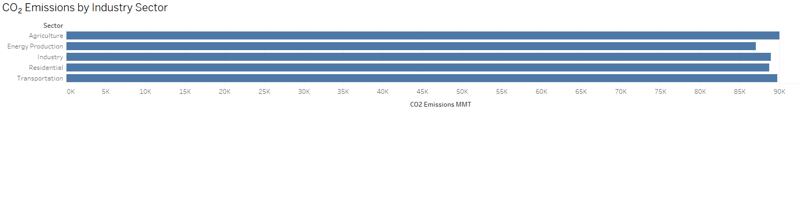
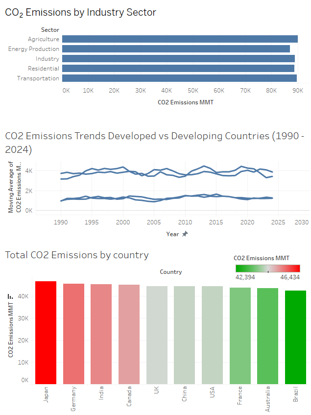
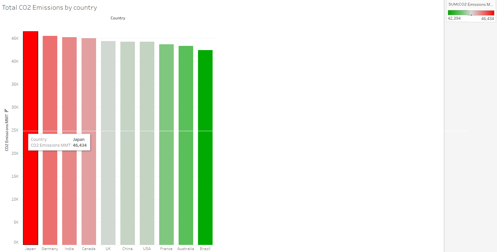

CO₂ Emissions Analysis (SQL + Tableau)

## Project Overview

This project analyzes global CO₂ emissions data to identify long-term trends, compare developed and developing countries, examine emissions by industry sector, and highlight the countries contributing most to overall emissions.

The project was built using SQL for data cleaning and analysis, and Tableau for dashboard development and visualization.

---

## Tools Used

## Tools Used

- SQL — data cleaning, joins, aggregation, and trend analysis
- Tableau — dashboards and data visualization
- CSV dataset — source data for emissions analysis

## Dataset Summary

- File: `CO2_Emissions_Analysis_Dataset.csv`
- Rows: 1,000+ records across 30 years
- Columns:
  - `country`, `year`
  - `industry_sector`, `emissions_mmt`
  - `region_type` (developed or developing)

---

## SQL Scripts

- `data_cleaning.sql`: Handles missing values and prepares structured tables
- `emissions_trends.sql`: Analyzes emissions by year, country group
- `country_comparison.sql`: Ranks countries by total emissions

---

## Tableau Visualizations

### CO₂ Emissions Trends (Developed vs Developing, 1990–2024)

### Emissions by Industry Sector

### Final Dashboard Overview

### Total Emissions by Country

_(Dashboard created in Tableau, file: CO2_Emissions_Analysis.twbx)_

---

## Key Insights

- Developed nations show fluctuating but declining emissions, while developing nations trend upward
- Energy production and transportation are leading sectors in global CO₂ output
- Japan, Germany, and India are among the top contributors in the dataset analyzed

---

## How to Reproduce

1. Clone this repo and download all files
2. Run `.sql` scripts in BigQuery or your preferred SQL engine
3. Load the CSV in Tableau
4. Open `.twbx` to view the full dashboard

---

## Future Enhancements

- Add per capita emission comparisons
- Integrate real-time emissions data via public APIs
- Expand dashboard with dynamic filters and drill-downs

---

👤 Author  
**Akash Pandya**  
Freelance Data Analyst | SQL, Tableau, R, Excel  
[Portfolio Website](https://aakashpandya.netlify.app) • [GitHub](https://github.com/akashpandya) • [LinkedIn](https://www.linkedin.com/in/akash-pandya100/)
